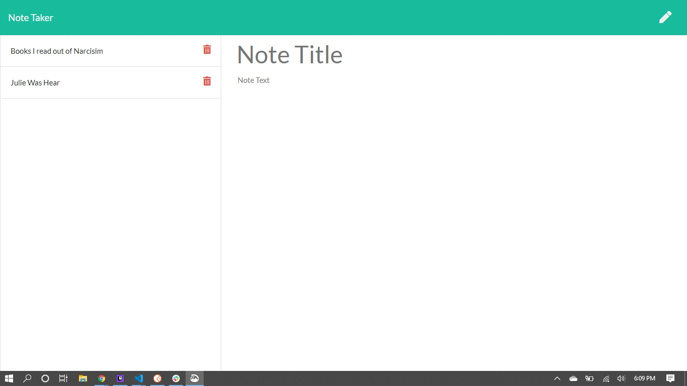
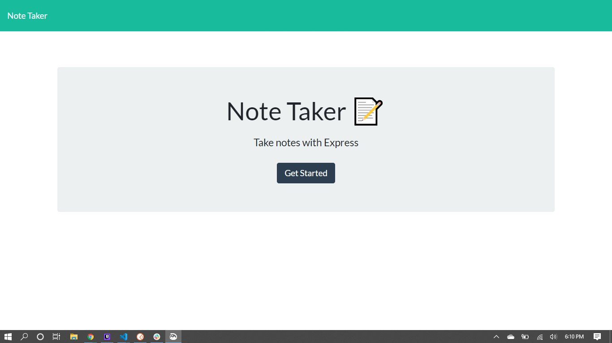

# Note Taker

## What it is

This is a web application that will allow users to write and save notes.

## Where it is

The live deployment is located here: <https://blooming-shore-12118.herokuapp.com/>

## How to use it

From the home page click on the get started button.

On the Note Taker screen click the pen in the upper right corner.  This will allow you to edit the notes.

To add a note, click on the "Note Title" and enter in the title of your note. After the title is entered, click the "Note Text" and enter in the the text of your notes.

When there is text in both the title and body of the note the save icon will appear in the upper right hand corner. Click this to save the note. The notes page will refresh and display your note on the left hand side of the screen.

To view any note, click on the note's title in the list on the left side of the screen. It will display in the body of the page.

To delete a note, click on the red trash can icon next to the note's title. This will remove the note from the note's list and refresh the page.
